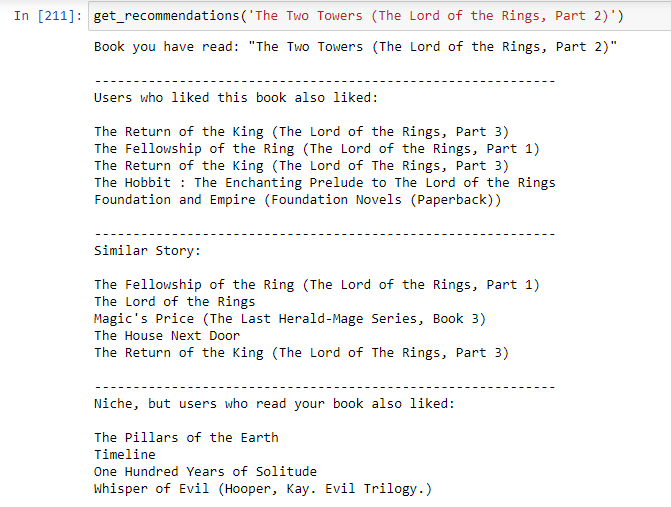
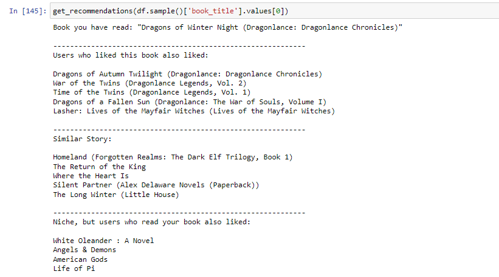
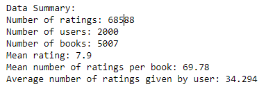
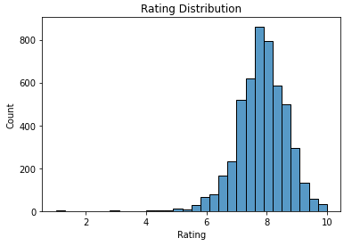
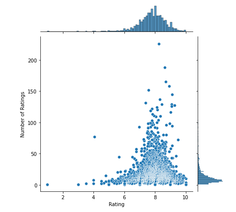
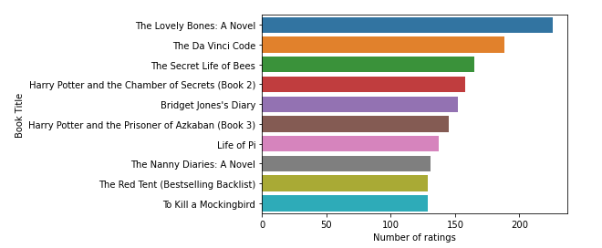
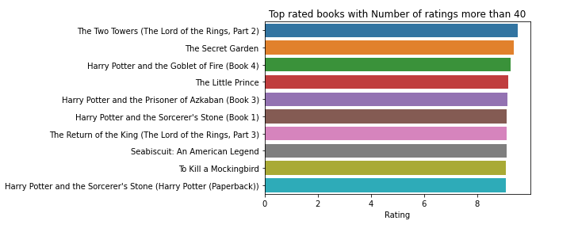

# Book Recommender System
* Created recommending system using **Content-Based** and **Collaborative Filtering** methods.
* Model based on dataset with 68588 ratings, 2000 users and 5007 books.
* Engineered the data for the project needs.
* Built function that prints recommended books to the console.

# Code and Resources Used
* **Python Version:** 3.9.7
* **Packages:** pandas, numpy, sklearn, matplotlib, seaborn
* **For Requirements Simply:** ```pip install -r requirements.txt```
* **Dataset:** https://www.kaggle.com/datasets/ruchi798/bookcrossing-dataset

# Recommendation Examples
  

# Data Cleaning
After dropping columns not needed, with each sample we have:
* user_id
* book_title
* rating
* book_author
* year_of_publication
* summary

The following changes to the dataset were made:
* The ratings with value of 0 were dropped as it seemed that they are supposed to be non ratings.
* Calculated the number of ratings each book received and limited the books to the ones with this value over 10.
* Calculated the number of ratings each user gave. Left top 2000 active users in the dataset.
* Some books had multiple summaries, because of several publications. That's why I transformed it so every sample have the same summary as it was needed for the content-based model bulding process. 

Summary of the dataset:\


## Exploratory Data Analysis

Some visualized insight from data:

**Rating Count Distribution** **Rating vs Number of Ratings**
* The most common rating is about 8 out of 10.
* There is very low number of ratings under 5.   



**Rating vs Number of Ratings**
* Very similar to the Rating Count Distribution
 

**Most Frequently Rated Books** 



**Top Rated Books**  

 

## System Building
**User-Item Matrix**\
First step was to create user-item matrix. So, I created matrix of zeros of size: (number of users, number of items) using **numpy** and then filled it with ratings from the data.\
The idea behind this is well visualized by this image:


**Collaborative Filtering**\
These can be split into two categories: user-based and item-based filtering and for each we create similarity matrix.
These similarities can be described as follows:
* *Item-Item Collaborative Filtering*: “Users who liked this item also liked …”
* *User-Item Collaborative Filtering*: “Users who are similar to you also liked …”

In order to check the model's performance model I split the data into train and test split with test size of 25%.
The similarity metric I have applied to the train set is **cosine similarity**. In this method similarity is calculated based on the angle between vectors. 

**Evaluation**\
The metric to evaluate the accuracy of predicted ratings is Root Mean Squared Error (RMSE).
I have used MSE function from **sklearn** and simply squared it. These are the results:
* User-based CF RMSE: 8.010185676597473
* Item-based CF RMSE: 8.08024101974398

Results for model without train test split:
* User-based CF RMSE (All data): 7.258342718896441
* Item-based CF RMSE (All data): 7.33069003330777

Later on I found out that the cosine similarity favours very popular books. I thought it would be a nice idea to give the user more niche recommendations as well. That is why I have also used different similarity metric - Pearson Correlation.

* The Item-based Pearson Correlation RMSE: 8.06885197254186

**Content Based Filtering**\
For the need of this I have created **pandas** Series containing unique summary of each book and vectorized it using TF-IDF Vectorizer with ngram_range=(1,2) from **sklearn**. This technique evaluates importance of certain words or phrases in the document. With that transfomed data I again used cosine similarity to find correlation between books' summary.

**Recommendation Console Function**\
To make the system usable and show the effects I have created python function that prints to the console the actual recommendations for given book.\
I did the following:
* Mapped books' names with its index in the matrix and stored it in python dictionary.
* Created 3 functions for: **Content (book's summary) Based Similarity, Item Based similarity and Item Pearson Correlation**. Each of them returns names of top 5 books recommended by the model and its similarity values to the given book.
* Connected all the functions into one function with fair looking console output.

I have not used User-Based Similarity because of the cold-start problem - the users who are about to use this function are not included in the dataset.

## Resources
User-Item Matrix Image - https://www.advancinganalytics.co.uk/blog/2020/5/13/recommendation-systems
